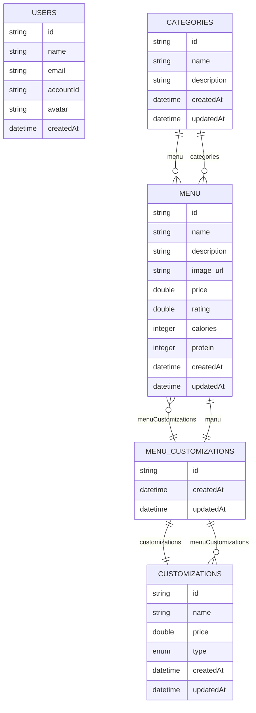

# Food Delivery App

A modern React Native mobile application for browsing, customizing, and ordering delicious meals — built with Appwrite (
for backend, auth & database) and NativeWind (for responsive, utility-first styling).

[//]: # (Screen here)

## Features:

- ✅ **User Authentication** — Sign up, sign in, and manage accounts securely with Appwrite.
- ✅ **Dynamic Menu** — Categories, menu items, and customizations all fetched from Appwrite Database.
- ✅ **Image Storage** — Menu images uploaded and served via Appwrite Storage.
- ✅ **Modern UI** — Styled with NativeWind (TailwindCSS for React Native).
- ✅ **Seed Script** — One-click data seeding to populate your Appwrite database.
- ✅ **Responsive Design** — Works seamlessly across iOS and Android.
- ✅ **Cart Functionality** — Add, remove, and customize items in your cart before checkout.
- ✅ **Sentry Integration** — Monitor and track errors in real-time for better app stability.
- ✅ **Search & Filter** — Easily find menu items by name or category.

## Tech Stack

| Layer            | Technology                                                                                                        |
|------------------|-------------------------------------------------------------------------------------------------------------------|
| Frontend         | [React Native](https://reactnative.dev)                                                                           |
| Styling          | [NativeWind](https://www.nativewind.dev) (TailwindCSS for RN)                                                     |
| Backend          | [Appwrite](https://appwrite.io) (Authentication, Database, Storage)                                               |
| Language         | [TypeScript](https://www.typescriptlang.org)                                                                      |
| State Management | [Zustand](https://zustand-demo.pmnd.rs)                                                                           |
| Image Uploads    | [Appwrite Storage](https://appwrite.io)                                                                           |
| Database Diagram | [Mermaid ER Diagram](https://docs.mermaidchart.com/mermaid-oss/syntax/entityRelationshipDiagram.html) (see below) |



## Setup & Installation

1. **Clone the Repository:**

   ```bash
   git clone git@github.com:DosserPaul/Food-Delivery-App.git
    cd Food-Delivery-App
    ```

2. **Install Dependencies:**
    ```bash
    npm install
    ```

3. **Configure Appwrite:**
    - Sign up for an [Appwrite](https://appwrite.io) account and create a new project.
    - Set up the necessary collections (Users, Categories, Menu, Customizations, Menu_Customizations) as per the ER
      diagram above.
    - Obtain your Appwrite endpoint and project ID.
    - Create a `.env` file in the root of the project and add your Appwrite configuration:
      ```env
      SENTRY_AUTH_TOKEN=
      EXPO_PUBLIC_APPWRITE_PROJECT_ID=
      EXPO_PUBLIC_APPWRITE_PROJECT_NAME="FoodDeliveryApp"
      EXPO_PUBLIC_APPWRITE_ENDPOINT=
      EXPO_PUBLIC_APPWRITE_DATABASE_ID=
      EXPO_PUBLIC_APPWRITE_USER_COLLECTION_ID=
      EXPO_PUBLIC_APPWRITE_CATEGORIES_COLLECTION_ID=
      EXPO_PUBLIC_APPWRITE_MENU_COLLECTION_ID=
      EXPO_PUBLIC_APPWRITE_COSTIMIZATIONS_COLLECTION_ID=
      EXPO_PUBLIC_APPWRITE_MENU_COSTIMIZATIONS_COLLECTION_ID=
      EXPO_PUBLIC_APPWRITE_ASSETS_BUCKET_ID=
      EXPO_PUBLIC_PLATFORM=com.<your-identifier>.<your-app-name>
        ```
4. **Seed the Database:**
    - Run the seed script to populate your Appwrite database with initial data:
      ```bash
      npm run seed
      ```

5. **Run the Application:**
    - Start the Expo development server:
    - ```bash
      npm start
      ```
